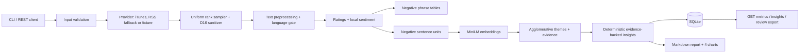
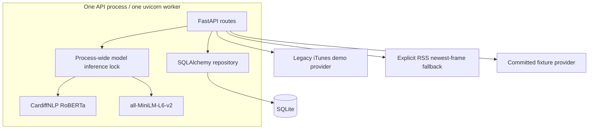

# Architecture

## Data flow

## Runtime components

## Trust boundaries

1. **User input** is validated before provider use: app ID/URL, country, sample size, seed and optional recent-window size.
2. **Apple rows** are untrusted external data. `sanitize_row()` strips everything except the review
   allowlist before persistence, export or analysis.
3. **Review text** is untrusted model input. The local models have no tools.
4. **Persistence/export** contains no reviewer nickname or profile URL.

## Determinism and reproducibility

- Sampling uses Floyd's algorithm over `random.Random(seed).random()`.
- The demo fixture records the exact ranks/replacements and replays with zero network access.
- Local model revisions are pinned and loaded offline after download.
- Bootstrap helpers are seeded.
- Report rendering consumes committed JSON inputs and has a golden test.
- Model floats are compared with tolerance (`1e-6`) across platforms; bit-identical PyTorch output is
  not claimed.

## Failure model

The API is synchronous by design for the take-home workload. Provider reads are the only operations
retried. Invalid input is never retried. Provider rate-limit, timeout, unavailable-feed and protocol errors have distinct
codes. Public mode also applies bounded in-memory POST token buckets. Missing local models make readiness fail and analyses that require them return
`MODEL_UNAVAILABLE`; there is no star/rule fallback for sentiment.
