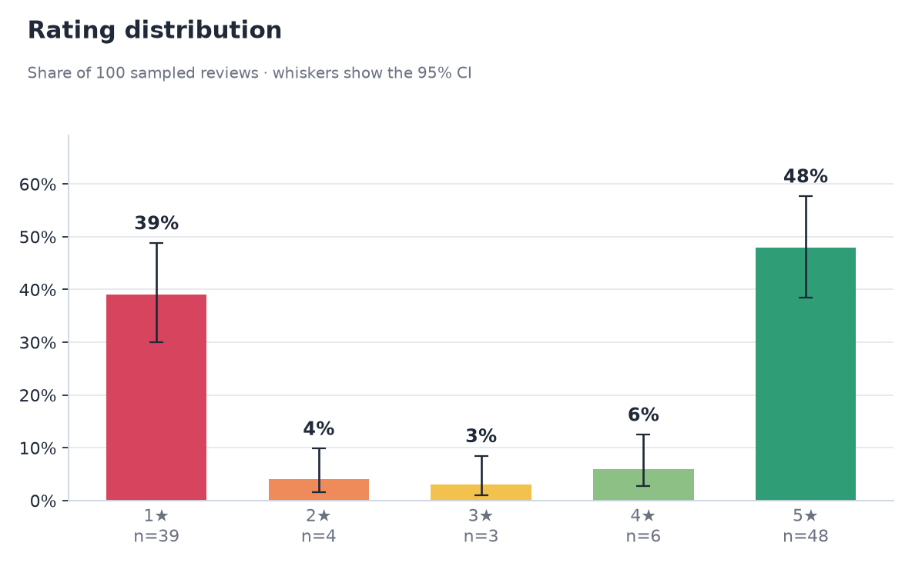
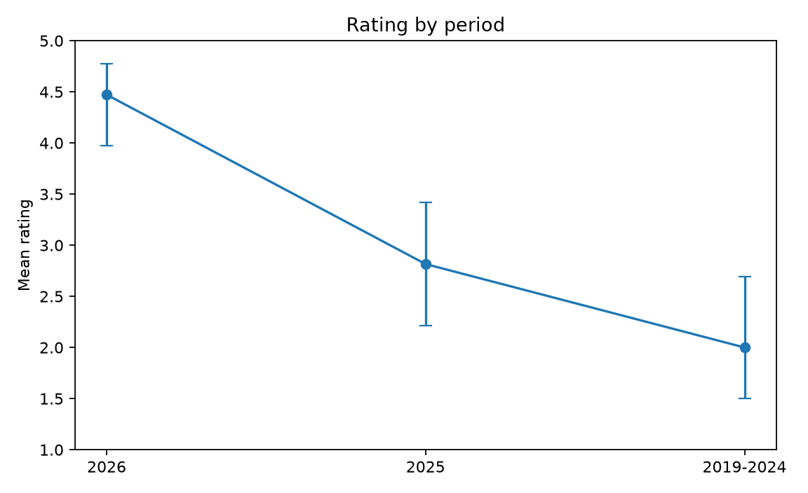
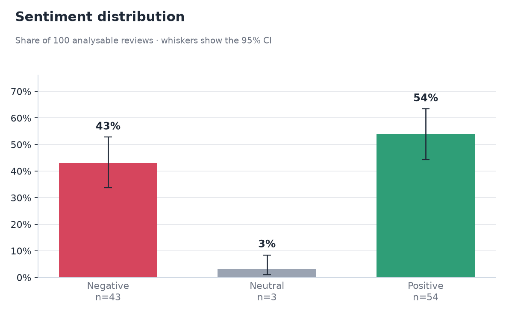
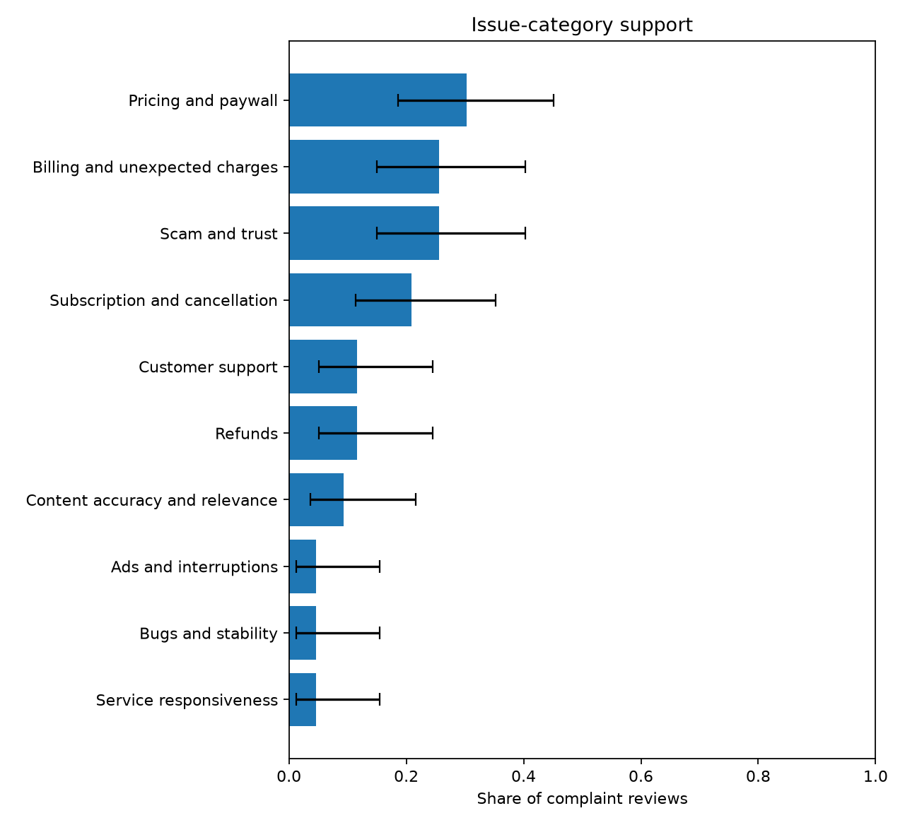

# Nebula: Spiritual Guidance - App Store review analysis

## Executive summary

The report analyses **100 sampled written reviews**. The sampled mean rating is **3.20/5**. Model-negative sentiment accounts for **43.0%** of analysable reviews.

Theme coverage: **10 of 103 complaint units (9.7%)** and **9 of 43 complaint reviews (20.9%)** are represented in supported themes.

**Theme coverage is below 50%.** The areas below describe only supported clusters; unclustered evidence remains in the `other` bucket and is not treated as a theme.

Highest-supported issue categories, ordered with recent evidence first:

- **Pricing and paywall**: 13 of 43 complaint reviews (30.2%; 95% CI 18.6% to 45.1%).
- **Billing and unexpected charges**: 11 of 43 complaint reviews (25.6%; 95% CI 14.9% to 40.2%).
- **Scam and trust**: 11 of 43 complaint reviews (25.6%; 95% CI 14.9% to 40.2%).
- **Subscription and cancellation**: 9 of 43 complaint reviews (20.9%; 95% CI 11.4% to 35.2%).
- **Customer support**: 5 of 43 complaint reviews (11.6%; 95% CI 5.1% to 24.5%).

## Dataset and provenance

| Field | Value |
| --- | --- |
| App | Nebula: Spiritual Guidance |
| App Store ID | 1459969523 |
| Storefront | us |
| Provider | itunes |
| Sampling method | uniform_random_rank |
| Frame | newest 15,002 of 15,002 |
| Population total | 15,002 |
| Reachable frame | 15,002 |
| Requested / actual | 100 / 100 |
| Sampling fraction | 0.7% |
| Seed | 42 |
| Collected at | 2026-09-29T17:16:29.209190Z |
| Analysis complete | True |

**Source:** Apple iTunes legacy customer-review endpoints.

The demo collector uses undocumented Apple iTunes endpoints that require an iTunes-client User-Agent and X-Apple-Store-Front header. The endpoint is used for this take-home demo only.

Model provenance:

| Component | Pinned model |
| --- | --- |
| Sentiment | cardiffnlp/twitter-roberta-base-sentiment-latest @ 3216a57f2a0d9c45a2e6c20157c20c49fb4bf9c7 |
| Embeddings | sentence-transformers/all-MiniLM-L6-v2 @ 1110a243fdf4706b3f48f1d95db1a4f5529b4d41 |

## Ratings

| Metric | Value |
| --- | --- |
| Sample size | 100 |
| Mean rating | 3.20 |
| Mean 95% CI | 2.82 to 3.56 |
| Median | 4.00 |
| Std. dev. | 1.89 |
| Store benchmark mean | 4.5738 |
| Store rating count | 170,804 |



Sample rating distribution:

| Stars | Count | Share | 95% CI |
| --- | --- | --- | --- |
| 1 | 39 | 39.0% | 30.0% to 48.8% |
| 2 | 4 | 4.0% | 1.6% to 9.8% |
| 3 | 3 | 3.0% | 1.0% to 8.5% |
| 4 | 6 | 6.0% | 2.8% to 12.5% |
| 5 | 48 | 48.0% | 38.5% to 57.7% |

### Population check

The one-off population walk contains **15,002** written reviews with a mean of **3.37**. The sampled mean differs by **-0.17 stars**.

| Metric | Walked population | Sample 95% CI | CI covers population? |
| --- | --- | --- | --- |
| Mean rating | 3.3712 | 2.82 to 3.56 | yes |
| 1-star share | 34.2% | 30.0% to 48.8% | yes |
| 2-star share | 3.7% | 1.6% to 9.8% | yes |
| 3-star share | 3.7% | 1.0% to 8.5% | yes |
| 4-star share | 7.8% | 2.8% to 12.5% | yes |
| 5-star share | 50.7% | 38.5% to 57.7% | yes |

Offline coverage simulation from the committed aggregate star distribution (**1,000** seeded samples, n=100; sampling without replacement; the same BCa/Wilson CI functions):

| CI target | Simulated coverage |
| --- | --- |
| Mean rating | 94.9% |
| 1-star share | 94.9% |
| 2-star share | 96.7% |
| 3-star share | 93.9% |
| 4-star share | 96.6% |
| 5-star share | 95.2% |

## Rating periods

| Period | n | Mean | Mean 95% CI | 1-2 star share |
| --- | --- | --- | --- | --- |
| 2026 | 36 | 4.47 | 3.97 to 4.78 | 8.3% |
| 2025 | 38 | 2.82 | 2.21 to 3.42 | 52.6% |
| 2019-2024 | 26 | 2.00 | 1.50 to 2.69 | 76.9% |



## Preprocessing

| Denominator | Count |
| --- | --- |
| All sampled reviews | 100 |
| Analysable reviews | 100 |
| Model-negative reviews | 43 |
| Other analysable reviews | 57 |
| Reviews with complaint units | 43 |
| Complaint units | 103 |

### Preprocessing flags

| Flag | Count |
| --- | --- |
| duplicate_title_body | 5 |
| short | 3 |

### Language counts

| Language | Count |
| --- | --- |
| en | 90 |
| und | 10 |

### Before/after examples

| Raw title + body | analysis_text |
| --- | --- |
| Title: Trial Period \\| Body: Trial period was not free my card was charged the same day and NO trial period was offered | Trial period was not free my card was charged the same day and NO trial period was offered |
| Title: Readings \\| Body: Readings were not bad | Readings were not bad |
| Title: Awesome app for immediate answers \\| Body: Awesome app for immediate answers. I love that you can chat live or send a message and wait. Great way to get some insight/outside perspective immediately on practically any situation/topic and the representat… | Awesome app for immediate answers. I love that you can chat live or send a message and wait. Great way to get some insight/outside perspective immediately on practically any situation/topic and the representatives all seem to really care about helping others. |
| Title: Scam \\| Body: Scam  I only allowed one dollar to come out of my Apple Pay and it took almost $100 out of my account through Apple Pay and I don’t understand how it did that but it did without my permission without my authorization   3×3 different times… | Scam I only allowed one dollar to come out of my Apple Pay and it took almost $100 out of my account through Apple Pay and I don’t understand how it did that but it did without my permission without my authorization 3×3 different times . I woke up at 5am n Ap… |
| Title: Love \\| Body: 10/10 | Love. 10/10 |

## Sentiment

Status: **ok**.

| Label | Count | Share | 95% CI |
| --- | --- | --- | --- |
| negative | 43 | 43.0% | 33.7% to 52.8% |
| neutral | 3 | 3.0% | 1.0% to 8.5% |
| positive | 54 | 54.0% | 44.3% to 63.4% |



Model: `cardiffnlp/twitter-roberta-base-sentiment-latest`

Revision: `3216a57f2a0d9c45a2e6c20157c20c49fb4bf9c7`

The sentiment model is derived from TweetEval/TimeLMs and therefore has a tweet-domain caveat.

### Rating consistency diagnostic

| Metric | Value |
| --- | --- |
| Comparable reviews | 97 |
| Agreement rate | 95.9% |
| Interpretation | Star ratings are a weak consistency proxy, not sentiment ground truth. |

### Evaluation summary

Evaluable hand-labelled reviews: **114**; mixed excluded from 3-class metrics: **36**.

| Model | Accuracy | Macro-F1 | Negative F1 |
| --- | --- | --- | --- |
| shipping_cardiffnlp | 0.930 | 0.752 | 0.968 |
| tabularisai_robust_sentiment | 0.851 | 0.643 | 0.919 |
| star_rating_floor | 0.868 | 0.660 | 0.917 |

Tabularis minus shipping negative-F1 paired BCa 95% CI: **-0.104 to -0.009**.

The neutral class is too small for a reliable standalone performance conclusion.

Pre-written model decision rule: Switch only if an eligible licence-clean 3-class challenger has a paired-bootstrap negative-F1 difference CI excluding zero in its favour; on a tie keep the better-documented model.

Annotator repeatability: kappa **1.000** on **30** repeated labels.

The repeat-label file does not encode session timing; this measures consistency of the supplied repeat labels and should be treated as an independent later-session estimate only when that timing is documented.

Complaint-unit check: precision **98.5%**, recall **60.3%**.

Theme-threshold check: selected threshold **none met the precision target**.

Issue-category precision audit: **not audited**.

## Keywords and phrases in negative reviews

Status: **ok**.

### A. Most common phrases

| Phrase | Negative reviews | Share of negative reviews | Other reviews |
| --- | --- | --- | --- |
| pay | 11 of 43 | 25.6% | 1 of 57 |
| scam | 10 of 43 | 23.3% | 0 of 57 |
| free | 9 of 43 | 20.9% | 1 of 57 |
| charge | 7 of 43 | 16.3% | 1 of 57 |
| money | 7 of 43 | 16.3% | 0 of 57 |
| read | 7 of 43 | 16.3% | 1 of 57 |
| subscription | 6 of 43 | 14.0% | 2 of 57 |
| to pay | 6 of 43 | 14.0% | 1 of 57 |
| answer | 5 of 43 | 11.6% | 0 of 57 |
| charged | 5 of 43 | 11.6% | 1 of 57 |
| chart | 5 of 43 | 11.6% | 1 of 57 |
| refund | 5 of 43 | 11.6% | 0 of 57 |
| a scam | 4 of 43 | 9.3% | 0 of 57 |
| ads | 4 of 43 | 9.3% | 0 of 57 |
| day | 4 of 43 | 9.3% | 1 of 57 |

### B. Most distinctive phrases

| Phrase | Negative reviews | Share of negative reviews | Other reviews | Fightin' Words z |
| --- | --- | --- | --- | --- |
| pay | 11 of 43 | 25.6% | 1 of 57 | 1.941 |
| free | 9 of 43 | 20.9% | 1 of 57 | 1.724 |
| charge | 7 of 43 | 16.3% | 1 of 57 | 1.458 |
| read | 7 of 43 | 16.3% | 1 of 57 | 1.458 |
| scam | 10 of 43 | 23.3% | 0 of 57 | 1.400 |
| to pay | 6 of 43 | 14.0% | 1 of 57 | 1.298 |
| money | 7 of 43 | 16.3% | 0 of 57 | 1.171 |
| charged | 5 of 43 | 11.6% | 1 of 57 | 1.113 |
| chart | 5 of 43 | 11.6% | 1 of 57 | 1.113 |
| answer | 5 of 43 | 11.6% | 0 of 57 | 0.990 |
| refund | 5 of 43 | 11.6% | 0 of 57 | 0.990 |
| day | 4 of 43 | 9.3% | 1 of 57 | 0.890 |
| trial | 4 of 43 | 9.3% | 1 of 57 | 0.890 |
| a scam | 4 of 43 | 9.3% | 0 of 57 | 0.885 |
| ads | 4 of 43 | 9.3% | 0 of 57 | 0.885 |

Fightin' Words z is used as a ranking score, not as a significance test. A ✓ marks z >= 1.96.

## Areas of improvement

Theme coverage: **10 of 103 complaint units (9.7%)** and **9 of 43 complaint reviews (20.9%)** are represented in supported themes.

**Theme coverage is below 50%.** The areas below describe only supported clusters; unclustered evidence remains in the `other` bucket and is not treated as a theme.

Complaint-unit score gate: kept **103** of **113** model-negative sentence candidates and removed **10** below the configured thresholds (0.85 for 4-5 star reviews; 0.50 otherwise).

### Issue categories

Categories use a fixed, app-agnostic whole-token lexicon over complaint sentences. A review can match multiple categories, so category shares overlap.

Category precision audit: **not audited**.

| Category | Reviews | Share and 95% CI | Mean stars | Recent (last 12 months) | Evidence IDs |
| --- | --- | --- | --- | --- | --- |
| Pricing and paywall | 13 of 43 | 30.2%; 18.6% to 45.1% | 1.23 | 30.8% | `13238168680`, `12196916604`, `11264084319` |
| Billing and unexpected charges | 11 of 43 | 25.6%; 14.9% to 40.2% | 1.00 | 27.3% | `11075169965`, `13793435927`, `13616064815` |
| Scam and trust | 11 of 43 | 25.6%; 14.9% to 40.2% | 1.00 | 18.2% | `12688614586`, `11075169965`, `13616064815` |
| Subscription and cancellation | 9 of 43 | 20.9%; 11.4% to 35.2% | 1.00 | 44.4% | `13793435927`, `13228610177`, `12971587569` |
| Customer support | 5 of 43 | 11.6%; 5.1% to 24.5% | 1.00 | 0.0% | `6904797208`, `12971587569`, `12829278222` |
| Refunds | 5 of 43 | 11.6%; 5.1% to 24.5% | 1.00 | 0.0% | `6904797208`, `12467337584`, `11449927296` |
| Content accuracy and relevance | 4 of 43 | 9.3%; 3.7% to 21.6% | 1.50 | 0.0% | `12164829797`, `8506856576`, `6782509379` |
| Ads and interruptions | 2 of 43 | 4.7%; 1.3% to 15.5% | 1.50 | 0.0% | `4696528106`, `11075169965` |
| Bugs and stability | 2 of 43 | 4.7%; 1.3% to 15.5% | 1.50 | 0.0% | `11099954190`, `5300736312` |
| Service responsiveness | 2 of 43 | 4.7%; 1.3% to 15.5% | 1.00 | 0.0% | `11075169965`, `6444787269` |

#### Pricing and paywall

Complaints about price, paid access, trials, or features being blocked behind payment.

Suggested investigation: Check whether pricing, trial conversion, and paid-feature boundaries are visible before users invest time in the product.

Top matched phrases: `pay` (8), `paid` (3), `cost` (2), `have to pay` (1), `need to pay` (1).

- `13238168680`: “I can’t even see my own birth chart without it telling me I need to pay.”
- `12196916604`: “On top of the subscription you STILL have to pay for readings.”
- `11264084319`: “I paid for all these supposed features and then had to pay more for a reading waste of 60.00”

#### Billing and unexpected charges

Complaints about billing events, debits, or charges the reviewer did not expect.

Suggested investigation: Check whether purchase, renewal, and billing confirmations make the timing and amount of charges clear before money is taken.

Top matched phrases: `charge` (7), `charged` (5).

- `11075169965`: “I will be reporting the charge with my bank as fraudulent!”
- `13793435927`: “Do not download this app I’ve had to order multiple debit cards because they charge your Apple account and there’s no way to cancel the subscription in the app nor does it show under your Apple subscription list”
- `13616064815`: “But after deleting the app is was charged 50 dollars for no reason.”

#### Scam and trust

Complaints that question the product's honesty, legitimacy, or representation.

Suggested investigation: Check whether product claims, purchase flows, and delivered value match what users are shown before they commit.

Top matched phrases: `scam` (10), `rip off` (1), `fraud` (1), `fraudulent` (1).

- `12688614586`: “Reporting as fraud”
- `11075169965`: “I will be reporting the charge with my bank as fraudulent!”
- `13616064815`: “This is a scam.”

#### Subscription and cancellation

Complaints about subscriptions, renewals, or difficulty cancelling recurring access.

Suggested investigation: Check whether subscription terms, renewal status, and cancellation controls are easy to find and complete across supported purchase channels.

Top matched phrases: `subscription` (5), `cancel` (2), `cancellation` (2), `canceled` (1), `cancelled` (1).

- `13793435927`: “Do not download this app I’ve had to order multiple debit cards because they charge your Apple account and there’s no way to cancel the subscription in the app nor does it show under your Apple subscription list”
- `13228610177`: “They will not accept your cancellation but it won’t show up on the app and they will continue to charge you despite having cancelled.”
- `12971587569`: “I canceled the free subscription and then saw how it was still pulling from my card.”

#### Customer support

Complaints about getting help from the product's support or customer-service function.

Suggested investigation: Check whether support requests reach an accountable owner and whether customers can see expected response and resolution paths.

Top matched phrases: `support` (3), `customer service` (2), `support team` (1).

- `6904797208`: “After 4 emails and prof I paid them I have been left on read by the support team.”
- `12971587569`: “When I logged into the app to try to figure out how and to contact support I can’t seem to find the option, as if it’s not there or very well hidden.”
- `12829278222`: “The customer service is horrible.”

#### Refunds

Complaints about requesting, receiving, or being denied money back.

Suggested investigation: Check whether refund eligibility, request steps, ownership, and response timing are clear to customers.

Top matched phrases: `refund` (4), `money back` (1), `no refund` (1).

- `6904797208`: “No answer received, no refund just left on read!!!”
- `12467337584`: “They would not refund me.”
- `11449927296`: “I want a refund and i want this to never happen to other people.”

#### Content accuracy and relevance

Complaints that generated or delivered content is wrong, generic, vague, or irrelevant.

Suggested investigation: Check whether the content is specific to the user's inputs and whether unsupported or generic outputs can be detected before delivery.

Top matched phrases: `not accurate` (1), `generic` (1), `vague` (1), `wrong` (1).

- `12164829797`: “Not only that but the horoscopes are very vague and negative.”
- `8506856576`: “Not accurate and a waste of money.”
- `6782509379`: “When you contact nebula’s support they give you a generic answer (exactly like the ones on all of the 1 star ratings) that they’re sorry you didn’t read their terms and conditions on what you’re buying (you never get the chance to before clicking) and that they can’t offer you a refund.”

#### Ads and interruptions

Complaints about advertising, pop-ups, or interruptions that disrupt product use.

Suggested investigation: Check whether advertising frequency, placement, and interruption points are concentrated in flows users expect to complete without disruption.

Top matched phrases: `ad` (2), `ads` (1).

- `4696528106`: “The ads for this app are not only definite lies but once you download the app and get through the whole personalized astrology experience, you can’t even use the features with out paying over $10 per month.”
- `11075169965`: “Deceiving ad - when you click on the free 3 day trial you are automatically taken to Apple Pay and once you click submit to activate the three day trial you are charged the monthly fee - what a rip off!”

#### Bugs and stability

Complaints about crashes, errors, broken flows, loading failures, or poor performance.

Suggested investigation: Check whether the affected flows share a release, device, network condition, or backend dependency that can be reproduced from telemetry.

Top matched phrases: `does not work` (1), `frozen` (1), `stuck` (1).

- `11099954190`: “Your app doesn’t work, especially the compatibility, it’s just a frozen screen and automatically switched to annual when I checked out for a week option.”
- `5300736312`: “I downloaded it twice and both times it was stuck on the loading screen.”

#### Service responsiveness

Complaints about live agents, advisers, readers, sellers, or other human-delivered service.

Suggested investigation: Check whether human-service availability, response-time expectations, and service-quality controls match what customers are promised.

Top matched phrases: `no response` (2).

- `11075169965`: “I reached out via email with no response just a screen shot of frequently asked questions.”
- `6444787269`: “Tried contacting these people through email and no response.”



### Emerging clusters

Semantic clusters remain a separate discovery layer; they are not merged into the fixed issue-category taxonomy.

#### Cluster 1: scam

Investigate scam: 9 of 43 complaint reviews (20.9%, 95% CI 11.4%-35.2%), for example 'Scam.'.

- Evidence review IDs: `11099954190`, `12351110123`, `12491998074`
- Newest evidence: 2026-01-10T07:17:26+00:00
- Share in last 12 months: 22.2%
- Historical-only: False

### Not categorised

**8 of 43 complaint reviews** (18.6%) did not match a supported issue category.

- `12936389038`: “horrible app.”
- `12756134004`: “Not a friendly app”
- `12517752126`: “I don’t do witchcraft!!”

## Limitations

- The sample covers written reviews in one storefront; star-only ratings are a different population.
- Confidence intervals quantify sampling uncertainty only; model and measurement error are separate.
- The Apple endpoint used for this demo is undocumented and may change without notice.
- Rank drift during live collection can cause duplicate/empty rows; the collector replaces them deterministically.
- Theme shares are conditional on the sentence classifier and clustering policy.
- The complaint-unit score thresholds are heuristics based on observed classifier errors and should be re-tuned on hand-labelled complaint units.
- The repeat-label file does not encode session timing, so its kappa measures repeat-label consistency but does not by itself prove independent later-session repeatability.
- Complaint-unit recall is low on mixed reviews (41.6%); theme extraction may miss embedded complaints.
- Complaint-unit recall is low on 4-5 star reviews (7.1%); theme extraction may miss embedded complaints.
- No evaluated theme distance threshold met the 0.80 same-issue precision target.
- Issue categories are lexicon-based heuristics with a fixed generic vocabulary; they are not learned from this app and can miss paraphrases or ambiguous uses.
- Issue-category shares are multi-label and may overlap; they must not be summed to 100%.
- Issue-category precision has not been measured; the optional human audit has not been run.
- Fewer than half of complaint units or complaint reviews are represented in supported themes, so theme conclusions are necessarily partial.

## Methodology

- Sampling: uniform random sample without replacement by review rank.
- Uncertainty: Wilson 95% intervals for proportions; seeded BCa bootstrap for means.
- Rating metrics use every sampled review; model-derived statistics use analysable reviews only.
- Common 1-3 grams and contrastive Fightin' Words rankings are calculated from negative reviews. Displayed phrases must contain at least one content token.
- Issue categories use a versioned, generic whole-token lexicon over score-gated complaint sentences; category support is review-level and multi-label.
- Complaint themes are built from score-gated negative sentences with pinned MiniLM embeddings and agglomerative clustering at cosine distance threshold 0.40.

## How to reproduce

```powershell
uv run reviews analyze --provider fixture `
  --snapshot data/fixtures/nebula_us_seed42.snapshot.json `
  --out reports/nebula_us_seed42.analysis.json
uv run reviews report
```

Fixture mode reproduces every count, label, rank, review ID and confidence interval. Analysis IDs, run timestamps and timings differ. Model scores are compared to 1e-6 because PyTorch does not promise bit-identical floating-point results across platforms.
