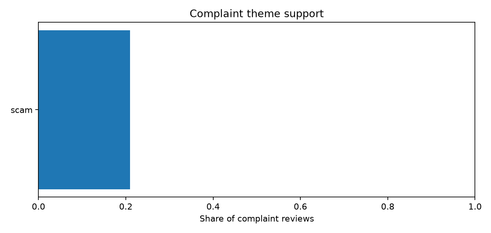

# Nebula: Spiritual Guidance - App Store review analysis

## Executive summary

The report analyses **100 sampled written reviews**. The sampled mean rating is **3.20/5**. Model-negative sentiment accounts for **43.0%** of analysable reviews.

Theme coverage: **10 of 103 complaint units (9.7%)** and **9 of 43 complaint reviews (20.9%)** are represented in supported themes.

**Theme coverage is below 50%.** The areas below describe only supported clusters; unclustered evidence remains in the `other` bucket and is not treated as a theme.

Most actionable supported areas, ordered with recent evidence first:

- Investigate scam: 9 of 43 complaint reviews (20.9%, 95% CI 11.4%-35.2%), for example 'Scam.'.

## Dataset and provenance

| Field | Value |
| --- | --- |
| App | Nebula: Spiritual Guidance |
| App Store ID | 1459969523 |
| Storefront | us |
| Provider | itunes |
| Sampling method | uniform_random_rank |
| Frame | newest 15,002 of 15,002 |
| Population total | 15,002 |
| Reachable frame | 15,002 |
| Requested / actual | 100 / 100 |
| Sampling fraction | 0.7% |
| Seed | 42 |
| Collected at | 2026-09-29T17:16:29.209190Z |
| Analysis complete | True |

**Source:** Apple iTunes legacy customer-review endpoints.

The demo collector uses undocumented Apple iTunes endpoints that require an iTunes-client User-Agent and X-Apple-Store-Front header. The endpoint is used for this take-home demo only.

Model provenance:

| Component | Pinned model |
| --- | --- |
| Sentiment | cardiffnlp/twitter-roberta-base-sentiment-latest @ 3216a57f2a0d9c45a2e6c20157c20c49fb4bf9c7 |
| Embeddings | sentence-transformers/all-MiniLM-L6-v2 @ 1110a243fdf4706b3f48f1d95db1a4f5529b4d41 |

## Ratings

| Metric | Value |
| --- | --- |
| Sample size | 100 |
| Mean rating | 3.20 |
| Mean 95% CI | 2.82 to 3.56 |
| Median | 4.00 |
| Std. dev. | 1.89 |
| Store benchmark mean | 4.5738 |
| Store rating count | 170,804 |


Sample rating distribution:

| Stars | Count | Share | 95% CI |
| --- | --- | --- | --- |
| 1 | 39 | 39.0% | 30.0% to 48.8% |
| 2 | 4 | 4.0% | 1.6% to 9.8% |
| 3 | 3 | 3.0% | 1.0% to 8.5% |
| 4 | 6 | 6.0% | 2.8% to 12.5% |
| 5 | 48 | 48.0% | 38.5% to 57.7% |

### Population check

The one-off population walk contains **15,002** written reviews with a mean of **3.37**. The sampled mean differs by **-0.17 stars**.

| Metric | Walked population | Sample 95% CI | CI covers population? |
| --- | --- | --- | --- |
| Mean rating | 3.3712 | 2.82 to 3.56 | yes |
| 1-star share | 34.2% | 30.0% to 48.8% | yes |
| 2-star share | 3.7% | 1.6% to 9.8% | yes |
| 3-star share | 3.7% | 1.0% to 8.5% | yes |
| 4-star share | 7.8% | 2.8% to 12.5% | yes |
| 5-star share | 50.7% | 38.5% to 57.7% | yes |

Offline coverage simulation from the committed aggregate star distribution (**1,000** seeded samples, n=100; sampling without replacement; the same BCa/Wilson CI functions):

| CI target | Simulated coverage |
| --- | --- |
| Mean rating | 94.9% |
| 1-star share | 94.9% |
| 2-star share | 96.7% |
| 3-star share | 93.9% |
| 4-star share | 96.6% |
| 5-star share | 95.2% |

## Rating periods

| Period | n | Mean | Mean 95% CI | 1-2 star share |
| --- | --- | --- | --- | --- |
| 2026 | 36 | 4.47 | 3.97 to 4.78 | 8.3% |
| 2025 | 38 | 2.82 | 2.21 to 3.42 | 52.6% |
| 2019-2024 | 26 | 2.00 | 1.50 to 2.69 | 76.9% |


## Preprocessing

| Denominator | Count |
| --- | --- |
| All sampled reviews | 100 |
| Analysable reviews | 100 |
| Model-negative reviews | 43 |
| Other analysable reviews | 57 |
| Reviews with complaint units | 43 |
| Complaint units | 103 |

### Preprocessing flags

| Flag | Count |
| --- | --- |
| duplicate_title_body | 5 |
| short | 3 |

### Language counts

| Language | Count |
| --- | --- |
| en | 90 |
| und | 10 |

### Before/after examples

| Raw title + body | analysis_text |
| --- | --- |
| Title: Trial Period \\| Body: Trial period was not free my card was charged the same day and NO trial period was offered | Trial period was not free my card was charged the same day and NO trial period was offered |
| Title: Readings \\| Body: Readings were not bad | Readings were not bad |
| Title: Awesome app for immediate answers \\| Body: Awesome app for immediate answers. I love that you can chat live or send a message and wait. Great way to get some insight/outside perspective immediately on practically any situation/topic and the representat… | Awesome app for immediate answers. I love that you can chat live or send a message and wait. Great way to get some insight/outside perspective immediately on practically any situation/topic and the representatives all seem to really care about helping others. |
| Title: Scam \\| Body: Scam  I only allowed one dollar to come out of my Apple Pay and it took almost $100 out of my account through Apple Pay and I don’t understand how it did that but it did without my permission without my authorization   3×3 different times… | Scam I only allowed one dollar to come out of my Apple Pay and it took almost $100 out of my account through Apple Pay and I don’t understand how it did that but it did without my permission without my authorization 3×3 different times . I woke up at 5am n Ap… |
| Title: Love \\| Body: 10/10 | Love. 10/10 |

## Sentiment

Status: **ok**.

| Label | Count | Share | 95% CI |
| --- | --- | --- | --- |
| negative | 43 | 43.0% | 33.7% to 52.8% |
| neutral | 3 | 3.0% | 1.0% to 8.5% |
| positive | 54 | 54.0% | 44.3% to 63.4% |


Model: `cardiffnlp/twitter-roberta-base-sentiment-latest`

Revision: `3216a57f2a0d9c45a2e6c20157c20c49fb4bf9c7`

The sentiment model is derived from TweetEval/TimeLMs and therefore has a tweet-domain caveat.

### Rating consistency diagnostic

| Metric | Value |
| --- | --- |
| Comparable reviews | 97 |
| Agreement rate | 95.9% |
| Interpretation | Star ratings are a weak consistency proxy, not sentiment ground truth. |

### Evaluation summary

Evaluable hand-labelled reviews: **114**; mixed excluded from 3-class metrics: **36**.

| Model | Accuracy | Macro-F1 | Negative F1 |
| --- | --- | --- | --- |
| shipping_cardiffnlp | 0.930 | 0.752 | 0.968 |
| tabularisai_robust_sentiment | 0.851 | 0.643 | 0.919 |
| star_rating_floor | 0.868 | 0.660 | 0.917 |

Tabularis minus shipping negative-F1 paired BCa 95% CI: **-0.104 to -0.009**.

The neutral class is too small for a reliable standalone performance conclusion.

Pre-written model decision rule: Switch only if an eligible licence-clean 3-class challenger has a paired-bootstrap negative-F1 difference CI excluding zero in its favour; on a tie keep the better-documented model.

Annotator repeatability: kappa **1.000** on **30** repeated labels.

The repeat-label file does not encode session timing; this measures consistency of the supplied repeat labels and should be treated as an independent later-session estimate only when that timing is documented.

Complaint-unit check: **evaluation not run** (units_gold.csv missing).

Theme-threshold check: **evaluation not run** (pairs_gold.csv missing).

## Keywords and phrases in negative reviews

Status: **ok**.

### A. Most common phrases

| Phrase | Negative reviews | Share of negative reviews | Other reviews |
| --- | --- | --- | --- |
| pay | 11 of 43 | 25.6% | 1 of 57 |
| scam | 10 of 43 | 23.3% | 0 of 57 |
| free | 9 of 43 | 20.9% | 1 of 57 |
| charge | 7 of 43 | 16.3% | 1 of 57 |
| money | 7 of 43 | 16.3% | 0 of 57 |
| read | 7 of 43 | 16.3% | 1 of 57 |
| subscription | 6 of 43 | 14.0% | 2 of 57 |
| to pay | 6 of 43 | 14.0% | 1 of 57 |
| answer | 5 of 43 | 11.6% | 0 of 57 |
| charged | 5 of 43 | 11.6% | 1 of 57 |
| chart | 5 of 43 | 11.6% | 1 of 57 |
| refund | 5 of 43 | 11.6% | 0 of 57 |
| a scam | 4 of 43 | 9.3% | 0 of 57 |
| ads | 4 of 43 | 9.3% | 0 of 57 |
| day | 4 of 43 | 9.3% | 1 of 57 |

### B. Most distinctive phrases

| Phrase | Negative reviews | Share of negative reviews | Other reviews | Fightin' Words z |
| --- | --- | --- | --- | --- |
| pay | 11 of 43 | 25.6% | 1 of 57 | 1.941 |
| free | 9 of 43 | 20.9% | 1 of 57 | 1.724 |
| charge | 7 of 43 | 16.3% | 1 of 57 | 1.458 |
| read | 7 of 43 | 16.3% | 1 of 57 | 1.458 |
| scam | 10 of 43 | 23.3% | 0 of 57 | 1.400 |
| to pay | 6 of 43 | 14.0% | 1 of 57 | 1.298 |
| money | 7 of 43 | 16.3% | 0 of 57 | 1.171 |
| charged | 5 of 43 | 11.6% | 1 of 57 | 1.113 |
| chart | 5 of 43 | 11.6% | 1 of 57 | 1.113 |
| answer | 5 of 43 | 11.6% | 0 of 57 | 0.990 |
| refund | 5 of 43 | 11.6% | 0 of 57 | 0.990 |
| day | 4 of 43 | 9.3% | 1 of 57 | 0.890 |
| trial | 4 of 43 | 9.3% | 1 of 57 | 0.890 |
| a scam | 4 of 43 | 9.3% | 0 of 57 | 0.885 |
| ads | 4 of 43 | 9.3% | 0 of 57 | 0.885 |

Fightin' Words z is used as a ranking score, not as a significance test. A ✓ marks z >= 1.96.

## Areas of improvement

Theme coverage: **10 of 103 complaint units (9.7%)** and **9 of 43 complaint reviews (20.9%)** are represented in supported themes.

**Theme coverage is below 50%.** The areas below describe only supported clusters; unclustered evidence remains in the `other` bucket and is not treated as a theme.

Complaint-unit score gate: kept **103** of **113** model-negative sentence candidates and removed **10** below the configured thresholds (0.85 for 4-5 star reviews; 0.50 otherwise).

### 1. scam

Investigate scam: 9 of 43 complaint reviews (20.9%, 95% CI 11.4%-35.2%), for example 'Scam.'.

- Evidence review IDs: `11099954190`, `12351110123`, `12491998074`
- Newest evidence: 2026-01-10T07:17:26+00:00
- Share in last 12 months: 22.2%
- Historical-only: False



## Limitations

- The sample covers written reviews in one storefront; star-only ratings are a different population.
- Confidence intervals quantify sampling uncertainty only; model and measurement error are separate.
- The Apple endpoint used for this demo is undocumented and may change without notice.
- Rank drift during live collection can cause duplicate/empty rows; the collector replaces them deterministically.
- Theme shares are conditional on the sentence classifier and clustering policy.
- The complaint-unit score thresholds are heuristics based on observed classifier errors and should be re-tuned on hand-labelled complaint units.
- The repeat-label file does not encode session timing, so its kappa measures repeat-label consistency but does not by itself prove independent later-session repeatability.
- The complaint-unit precision/recall check was not run.
- The labelled-pair theme-threshold check was not run.
- Fewer than half of complaint units or complaint reviews are represented in supported themes, so theme conclusions are necessarily partial.

## Methodology

- Sampling: uniform random sample without replacement by review rank.
- Uncertainty: Wilson 95% intervals for proportions; seeded BCa bootstrap for means.
- Rating metrics use every sampled review; model-derived statistics use analysable reviews only.
- Common 1-3 grams and contrastive Fightin' Words rankings are calculated from negative reviews. Displayed phrases must contain at least one content token.
- Complaint themes are built from score-gated negative sentences with pinned MiniLM embeddings and agglomerative clustering at cosine distance threshold 0.40.

## How to reproduce

```powershell
uv run reviews analyze --provider fixture `
  --snapshot data/fixtures/nebula_us_seed42.snapshot.json `
  --out reports/nebula_us_seed42.analysis.json
uv run reviews report
```

Fixture mode reproduces every count, label, rank, review ID and confidence interval. Analysis IDs, run timestamps and timings differ. Model scores are compared to 1e-6 because PyTorch does not promise bit-identical floating-point results across platforms.
